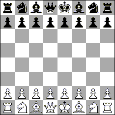

### Нотация записи шахматных диаграмм FEN (Форсайта-Эдвардса)

Нотация Форсайта-Эдвардса (FEN) - стандартная нотация записи шахматных диаграмм. Запись FEN описывает позицию на шахматной доске в виде строки ASCII символов.

FEN основывается на системе шотландского журналиста Дэвида Форсайта (David Forsyth), популярной в XIX веке. Стивен Эдвардс (Steven J. Edwards) усовершенствовал систему для использования на компьютере.

Сейчас нотация FEN применяется для загрузки позиции в шахматную программу для последующего компьютерного анализа, а также для публикации диаграмм на веб-сайтах и тематических шахматных форумах. Нотация FEN может применяться также для позиций, возникающих в партиях по правилам шахмат Фишера.

**Поля записи в нотации FEN**   

1. Положение фигур со стороны белых.  
  Позиция описывается цифрами и буквами по горизонталям сверху вниз начиная с восьмой горизонтали и заканчивая первой. 
  Расположение фигур на горизонтали записывается слева направо, данные каждой горизонтали разделяются косой чертой "/".  
  Белые фигуры обозначаются заглавными буквами.  
  K, Q, R, B, N, P - соответственно белые король, ферзь, ладья, слон, конь, пешка.  
  k, q, r, b, n, p - соответственно чёрные король, ферзь, ладья, слон, конь, пешка.  
  Обозначения фигур взяты из англоязычного варианта алгебраической нотации. 
  Цифра задаёт количество пустых полей на горизонтали, 
  счёт ведётся либо от левого края доски, 
  ибо после фигуры (8 означает пустую горизонталь).

2. Очередность хода:  
  w - следующий ход принадлежит белым, b - следующий ход чёрных.

3. Возможность рокировки.  
  k - в сторону королевского фланга (короткая),  
  q - в сторону ферзевого фланга (длинная).  
  Заглавными указываются белые.  
  Невозможность рокировки обозначается "-".

4. Возможность взятия пешки на проходе.  
   Указывается проходимое поле, иначе "-".

5. Счётчик полуходов.  
   Число полуходов, прошедших с последнего хода пешки или взятия. 
   Используется для определения применения правила 50 ходов в шахматах.

6. Номер хода.  
   Любой позиции может быть присвоено любое неотрицательное значение (по умолчанию 1),  
   счётчик увеличивается на 1 после каждого хода чёрных.  

Например, начальная позиция шахматной партии имеет код FEN: 
 
```
rnbqkbnr/pppppppp/8/8/8/8/PPPPPPPP/RNBQKBNR w KQkq - 0 1
```



```
rnbqkbnr - расположение фигур на 8-й горизонтали слева направо, 
/ - разделитель
pppppppp - расположение фигур на 7-й горизонтали
8/8/8/8 - пустые 6, 5, 4 и 3 горизонтали
PPPPPPPP - расположение фигур на 2 горизонтали
RNBQKBNR - расположение фигур на 1 горизонтали
w - предстоит ход белых
KQkq - возможны короткие и длинные рокировки белых и чёрных
(-) - не было предыдущего хода пешкой на два поля
(0) - последних ходов без взятий или движения пешек не было
(1) - предстоит первый ход
```