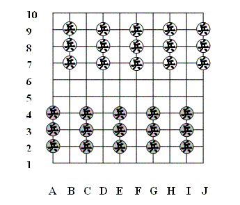
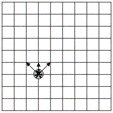
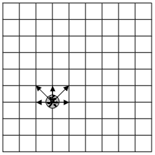
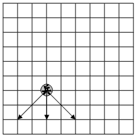
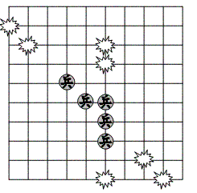
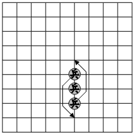

# Пушка (Cannon)

<https://boardspace.net/cannon/english/Cannon.htm>

В «Пушку» играют на доске 10х10 
со следующей расстановкой: 
в восточной традиции вместо ячеек 
используются точки пересечения.

## Расстановка

  

Расстановка завершается тем, 
что сначала черные, 
а затем красные игроки размещают 
свою **Крепость** (Town) в первом ряду, 
исключая углы. 
Таким образом, 
черный цвет поместит Крепость в ряд 1, 
а красный — в ряду 10. 
После размещения крепость 
остается на своем месте 
на протяжении всей игры.

Солдат может переместиться в соседнюю 
(ортогональную или диагональную) 
переднюю пустую точку.

## Движение

Cолдат перемещяется на соседнюю 
(ортогональную или диагональную) 
переднюю или боковую клетку.

  

## Атака

Солдат может захватить фигуру 
на соседней (ортогональной 
или диагональной) передней 
или боковой клетке.

 

## Отступление

Отступите фигурой назад 
(ортогонально или по диагонали) 
на две клетки, 
если фигура примыкает к фигуре 
противника. 
Обе клетки должны быть 
пустыми.

 

## Выстрел

 **Пушка** — это (ортогональная или диагональная) 
линия из трех соседних 
дружественных солдат. 
Пушка может произвести 
захват вражеских фигур 
без движения своих фигур  
(т. е. пушечный выстрел) 
по двум или трем позициям 
на линии группы до тех пор, 
пока фигуры на позиции 
непосредственно перед пушкой 
не будут захвачены.

 

## Сдвиг

Солдат также может смещаться 
по своей длине в любом направлении 
без захвата вражеской фигуры.

 

Каждым ходом каждый игрок 
должен переместить солдата 
или использовать пушку. 
Пропуск хода не допускается.

Побеждает игрок, 
захвативший вражескую крепость солдатом 
или пушечным выстрелом 
(как мат в шахматах) 
или поставивший противника 
в тупик.