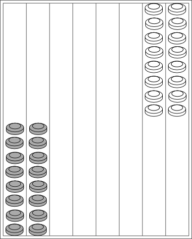
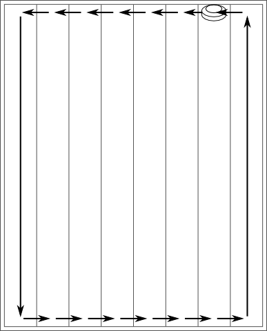

# Coan Ki

<http://www.cyningstan.com/game/1151/coan-ki>

1. Игра ведется на доске из восьми рядов. 
Каждый ряд условно разделен на две части, 
один конец принадлежит каждому игроку. 
На каждого игрока приходится шестнадцать 
двусторонних фигур и два кубика 
для управления движением.
2. Игроки садятся друг напротив друга, 
в концах отмеченных рядов. 
Каждый из них вносит в банк 
согласованную ставку.
3. Игра начинается со всеми фигурами на доске, 
причем у каждого игрока по восемь фигур на конце 
каждого из двух крайних слева от него рядов.
4. Каждый игрок бросает один кубик, 
бросив его повторно, 
если на двух кубиках выпало 
одинаковое число. 
Игрок, набравший наибольшее количество очков, 
имеет право первого хода и берет значение, 
указанное на двух кубиках, 
в качестве своего первого броска.
5. Направление движения — против часовой стрелки по доске, 
сначала от ряда к ряду до тех пор, 
пока не будет достигнут последний ряд игрока, 
затем по этому ряду (считая за одну клетку) 
до конца противника, 
затем обратно по рядам противника до тех пор, 
пока его достигнут последний ряд, 
затем обратно по этому ряду обратно 
на свою сторону игрока.
6. Бросок двойной единицы не позволяет 
фигуре двигаться. 
Вместо этого игрок должен заплатить противнику 
штраф в размере 10% от ставки. 
В качестве компенсации он убирает одну из своих фигур с доски, 
а это означает, что для прохождения курса 
нужно меньше фигур.
7. Выбрасывание двух последовательных номеров, 
скажем, 5 и 6, позволяет игроку  
(а) переместить одну фигуру на меньшее число, 
а другую на общую сумму (5 и 11 в этом примере) или  
(б) переместить обе фигуры. на единицу меньше общей суммы, 
а затем на одну из них еще пробел (10 и 11 в примере).
8. Бросок дублетов, напр. 4 и 4, позволяет игроку  
(а) переместить одну фигуру на половину суммы (в этом примере 4) или  
(б) переместить две фигуры каждую на полную сумму 
(в этом примере 8).
9. Бросок, который не состоит из дублета 
или двух последовательных номеров, 
позволяет игроку выбрать:  
(а) переместить одну фигуру по доске на общее количество мест, 
указанных на кубике, или  
(б) переместите две фишки, одну на количество мест, 
указанное на каждом кубике.
10. В этой игре нет захватов. 
Фигура удаляется только при броске 
двойной единицы.
11. Когда фигура завершает свой путь, 
ее переворачивают 
(т. е. кладут вверх тормашками или на бок) 
в ее конечное положение, 
чтобы отличить ее от фигур, 
которые еще не отправились 
в путь.
12. Бросок необходимо использовать 
полностью. 
Если его нельзя использовать, 
то весь бросок теряется; 
невозможно использовать один кубик, 
а не другой. 
Также не разрешается отказываться от броска, 
если его можно использовать.
13. Игрок выигрывает партию, 
когда возвращает все свои (оставшиеся) 
фигуры на исходные позиции.