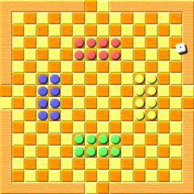

# KilkennyCats

<http://www.cyningstan.com/game/392/the-amusing-game-of-kilkenny-cats>

1. Начало игры:  
В игру **KilkennyCats** играют два или четыре человека 
на доске размером 14x14 клеток, 
причем на каждом краю доски добавлено 
по паре дополнительных клеток. 
У каждого игрока есть восемь фигур, 
указанных на схеме. 
Если играют двое, 
они садятся напротив.  
Есть кубик, который влияет 
на ход фигур. 
Игроки случайным образом решают, 
кто начнет.

2. Перемещение фигур:  
игрок сначала перемещает фигуру, 
бросая кубик, 
а затем перемещая одну из своих фигур 
в любом из восьми направлений ровно 
на количество клеток, 
указанное на кубике. 
Фигуры не могут прыгать друг на друга, 
и игрок не может располагать две свои фигуры 
на одном поле. 
Если допустимого хода нет, 
ход теряется.

3. Захват врагов:  
фигура захватывает врага, 
приземляясь на него. 
Фигура убирается с доски 
и больше не участвует 
в игре.

4. Победа в игре:  
это достигается не путем захвата 
всех фигур противника, 
а путем занятия двух клеток ворот 
на краю доски, 
противоположного тому месту, 
где начали ваши фигуры.

