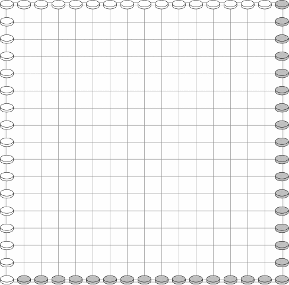

# Ming Mang

<http://www.cyningstan.com/game/328/ming-mang>

  

В игру играют два игрока на квадратной доске, 
размеченной сеткой из линий. 
Для целей данной брошюры будет использована 
традиционная доска размером 17 на 17 точек. 
Каждому игроку понадобится 64 фишки,
 32 из которых лежат на доске, 
а 32 хранятся в запасе.

1. В начале игры у каждого игрока 
половина своих фигур заполняет 
два соседних края доски, 
как показано на схеме.
2. Белые делают первый ход.
3. Каждый ход игрок перемещает одну фигуру 
по отмеченной линии настолько далеко, 
насколько ему заблагорассудится.
4. Фигура не может перепрыгивать через другую.
5. Фигура должна остановиться на пустой клетке.
6. Игрок может захватить ряд фигур противника, 
поставив по две свои на каждом конце ряда, 
по одной на каждом конце ряда.
7. Такие ряды фигур должны быть 
горизонтальными или вертикальными. 
Невозможно захватить диагональные 
ряды.
8. При захвате фигуры противника заменяются 
фигурами цвета захватившего игрока. 
Следовательно, 
на доске всегда 64 фигуры.
9. Игра заканчивается, 
когда один игрок не может 
двигаться. 
Это может быть по одной из следующих причин:
>(i). у игрока не осталось фигур, или  
>(ii). у игрока есть фигуры, но они застряли 
и не могут двигаться.
10. Игрок, который не может двигаться, 
проигрывает, 
а его противник объявляется 
победителем.
