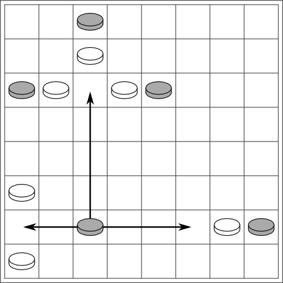

# Petteia

<http://www.cyningstan.com/game/63/petteia>

Правила для **Petteia** и **Ludus Latrunculorum**

Эти правила применимы к ludus latrunculorum, 
когда фрагмент dux отсутствует.  
Правила игр с участием дукса приведены в другом месте.

1. Игра ведется на доске из клеток любого размера, 
которая есть в наличии у игроков. 
8 рядов по 8 квадратов – это наиболее удобно 
для современных игроков.

2. Фишки раскладываются на доске следующим образом: 
каждому игроку хватает фишек, 
чтобы заполнить два ряда доски; 
фишки каждого игрока размещаются 
в двух ближайших к нему рядах;

3. Белые ходят первыми.

4. Игрок в свой ход перемещает одну фигуру 
с одного поля на другое. 
Все фигуры движутся настолько далеко, 
насколько пожелает игрок, 
по прямой линии по горизонтали 
или вертикали.

5. Фигура не может приземлиться на другую фигуру 
или перепрыгнуть ее.

6. Вражеская фигура захватывается путем захвата ее 
между двумя собственными фигурами игрока по прямой линии 
по горизонтали или вертикали; 
взятая фигура немедленно убирается с доски;

7. Если движущаяся фигура захватывает двух или трех врагов 
между отдельными товарищами, 
то все эти два или три врага 
захватываются.

8. Однако допустимо, 
чтобы фигура добровольно встала 
между двумя врагами без вреда для себя.

9. Игра заканчивается, 
когда игрок превращается в одну фигуру, 
что не позволяет ему продолжать войну. 
Его соперник – победитель

10. Игра также заканчивается, если один игрок полностью зажат 
и не может двигаться; 
его противник также является 
победителем.

11. Игроки могут согласиться на ничью, 
если игра не имеет очевидного исхода 
в пользу того или иного игрока.
