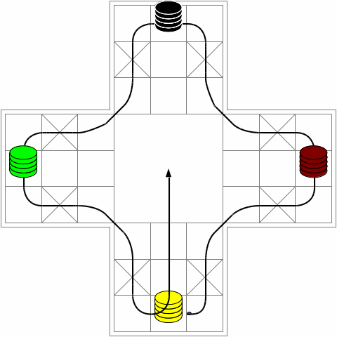

# T'shu-p'u

<http://www.cyningstan.com/game/159/tshu-pu>

## Правила Тшу-пу

1. В Тшу-пу играют четыре игрока в двух командах. 
Красные и зеленые игроки противостоят желтым и черным. 
Члены каждой команды садятся друг напротив друга.

2. Доска представляет собой крест с одним большим квадратом 
в центре и ветвями,
состоящими из девяти квадратов, 
расположенных три на три. 
Квадраты по краям каждого плеча 
имеют маркировку поперечного разреза: 
см. схему.

3. У каждого игрока есть четыре фишки своего цвета, 
начиная с центрального квадрата его конца креста, 
как показано на схеме. 
Есть два четырехгранных игральных кубика 
с номерами 1, 3, 4 и 6.

4. Игроки по договоренности или случайным образом решают, 
кто начинает игру. 
Затем игра продолжается по часовой стрелке 
вокруг доски.

5. Игрок начинает свой ход, 
бросая два кубика. 
Затем он перемещает одну или две свои фигуры 
по краю доски против часовой стрелки 
в зависимости от броска кубика:

>(i). одну фигуру можно передвигать по ходу, 
равному общему количеству квадратов, 
указанному на двух кубиках;

>(ii). в качестве альтернативы, значение, 
указанное на каждом кубике, можно использовать 
для перемещения отдельной фигуры на указанное 
количество мест.

6. Заход на центральное поле возможен 
только точным броском.

7. Если игрок ставит свою фигуру на поле, 
занятое одной или несколькими фигурами противника, 
эти фигуры ударяются и переходят в руки 
своих владельцев.

8. Игрок не может приземлиться на пересекающееся поле, 
если на нем есть фигуры противника.

9. Все игроки могут приземлиться на центральном поле, 
не задев и не получив ударов от фигур противника.

10. Игрок, имеющий фигуру на руках, 
может повторно вывести ее на доску через стартовое поле 
в зависимости от броска кубика в свой ход:

>(i). например, при броске 1 фигура помещается 
на стартовое поле;

>(ii). при броске 3 фигура передвигается 
на первое поперечное поле на своем пути 
и так далее.

11. Во время своего хода игрок может использовать бросок 1, 
чтобы вынести фигуру из центрального поля. 
После этого он завершает свой ход 
и удаляется из игры.

12. Команда побеждает, все ее фигуры унесены с доски.

