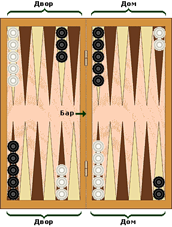
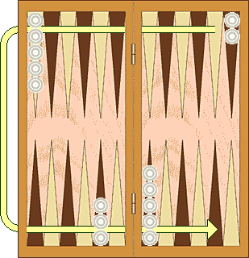
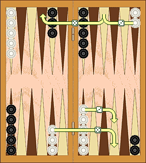
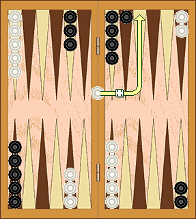
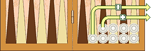

Короткие нарды
==============

Поиграть с компьютером:  
+ [ollgames.ru](https://ollgames.ru/korotkie-nardy-s-kompyuterom/)
+ ...

Начальная позиция
-----------------

  
Рис 1. Доска с шашками в начальной позиции.  
 
Возможна также расстановка, зеркально симметричная к той,
что приведена на рисунке.  
Дом в ней располагается слева, 
а двор - соответственно справа.  

Короткие нарды (Рис.1) - игра для двух игроков, на доске, 
состоящей из двадцати четырех узких треугольников, 
называемых _пунктами_. 
Треугольники чередуются по цвету и объединены в четыре группы 
по шесть треугольников в каждой. 
Эти группы называются - _дом_, _двор_, _дом противника_, _двор противника_. 
Дом и двор разделены между собой планкой, 
которая выступает над игровым полем и называется _бар_. 
Пункты нумеруются для каждого игрока отдельно, 
начиная с дома данного игрока. 
Самый дальний пункт является 24-м пунктом, 
он также является первым пунктом для оппонента. 
У каждого игрока имеется 15 шашек. 
Начальная расстановка шашек такова: 
у каждого из игроков по две шашки в двадцать четвертом пункте, 
пять в тринадцатом, три в восьмом и пять в шестом.  

Цель игры 
---------

Цель - перевести все свои шашки в свой дом и затем снять их с доски. 
Первый игрок, который снял все свои шашки, выигрывает партию. 

Движение шашек
----------------  

  
Рис 2. Направление движения белых шашек. 
Черные шашки движутся в противоположном направлении.   
 
Игроки поочередно бросают по две кости и выполняют ходы. 
Число на каждой кости показывают, на сколько пунктов, или шагов, 
игрок должен передвинуть свои шашки. 
Шашки всегда движутся только в одном направлении (Рис.2) - 
от пунктов с большими номерами к пунктам с меньшими.   
При этом применяются следующие правила:  
  - шашка может двигаться только на открытый пункт, то есть на такой, 
  который не занят двумя или более шашками противоположного цвета. 
  - числа на обеих костях составляют отдельные ходы.  
  
  
Рис. 3. Два способа, которыми белые могут сыграть   
  
К примеру, если у игрока выпало 5 и 3 (Рис. 3), то:
  - он может пойти одной шашкой на три шага, а другой - на пять, 
  - либо он может пойти одной шашкой сразу на восемь (пять плюс три) шагов, 
  но последнее лишь в том случае, если промежуточный пункт 
  (на расстоянии три или пять шагов от начального пункта) также открыт. 
  
Игрок, у которого выпал дубль, играет каждое из чисел на каждой из костей дважды. 
Например, если выпало 6-6, то игрок должен сделать четыре хода по шесть очков, 
и он может передвинуть шашки в любой комбинации, как сочтет нужным.  

Игрок должен использовать оба числа, которые ему выпали, 
если они допускаются правилами (либо все четыре числа, если у него выпал дубль). 
Когда можно сыграть только одно число, игрок обязан сыграть это число. 
Если каждое из чисел по отдельности можно сыграть (но не оба вместе), 
игрок должен играть большее число.  

Если игрок не может сделать хода, то он пропускает ход. 
В случае, если выпал дубль, если игрок не может использовать все четыре числа, 
он должен сыграть столько ходов, сколько возможно.  

Как побить и зарядить шашку
---------------------------

    
Рис 4. Если белым выпало, но одна из шашек на баре,  
они должны зарядить шашку в пункт 4 в доме черных,  
поскольку пункт 6 занят черными.  

Пункт, занятый только одной шашкой, носит название блот. 
Если шашка противоположного цвета останавливается на этом пункте, 
блот считается побитым и кладется на бар. 
В любой момент, когда одна или несколько шашек находятся на баре, 
первая обязанность игрока - это зарядить шашки в доме соперника. 
Шашка вступает в игру, перемещаясь на пункт, 
соответствующий выброшенному значению кости.  

К примеру, если игроку выпало 4 и 6, 
он может зарядить шашку в четвертый либо в шестой пункты, 
если они не заняты двумя или более шашками противника. 
Если оба пункта, соответствующие значениям выброшенных костей, 
заняты, игрок пропускает свой ход.  
 
Если игрок может ввести некоторые из своих шашек, но не все, 
он должен зарядить все шашки, которые возможно, 
и затем пропустить оставшуюся часть хода. 
После того, как все шашки будут введены с бара, 
неиспользованные значения костей можно использовать, 
как обычно, перемещая шашку, которую вы зарядили, 
либо любую другую шашку.  

Как выбросить шашки
-------------------

  
Рис 5. Белым выпало 4 и 6. Они выбрасывают две шашки.  

Когда игрок привел все свои пятнадцать шашек в свой дом, 
он может начать выбрасывать их с доски. 
Игрок выбрасывает шашку следующим образом: бросается пара костей, 
и шашки, которые стоят на пунктах, соответствующих выпавшим значениям, 
снимаются с доски. 
Например, если выпало 6 очков, можно снять шашку с шестого пункта.  

Если на пункте, соответствующем выпавшей кости, 
нет ни одной шашки, 
игроку разрешается переместить шашку с пунктов, 
больших, чем выпавшее число.  

Если игрок может сделать какие-либо ходы, 
он не обязан выбрасывать шашку с доски.  

В стадии выбрасывания шашек все шашки игрока должны находиться в его доме. 
Если шашка будет побита в процессе выбрасывания шашек, 
то игрок должен привести шашку обратно в свой дом, 
прежде чем он продолжит выбрасывать шашки. 
Тот, кто первый снял все шашки с доски, выигрывает партию.
